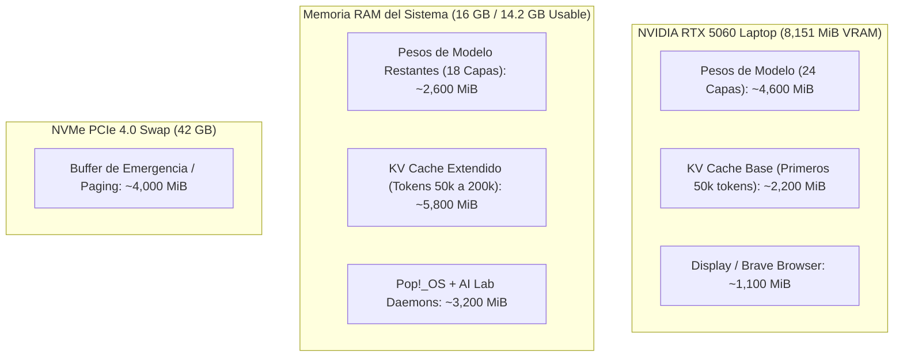
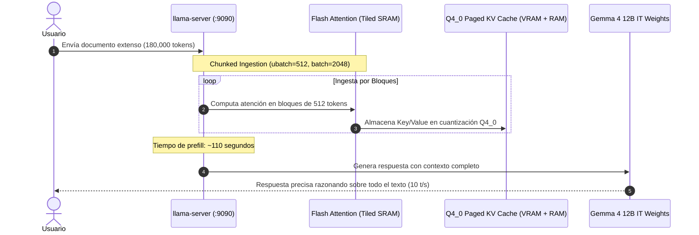

# Estudio de Factibilidad Técnica: Escalado de Contexto a 200,000 Tokens en Gemma 4 12B IT

**Autor:** AI Lab Engine & Architecture Team  
**Fecha:** 31 de Agosto de 2026  
**Objetivo:** Evaluar la viabilidad técnica, arquitectura de memoria, latencias y configuraciones óptimas para extender la ventana de contexto a **200,000 tokens** en hardware local.  
**Estado:** Documento de Diseño Arquitectónico (Teórico / Propuesta).

---

## 1. Resumen Ejecutivo y Veredicto

| Criterio | Veredicto |
| :--- | :--- |
| **Factibilidad Global** | 🟢 **VIABLE** (Utilizando estrategia híbrida GPU VRAM + System RAM + YaRN RoPE Scaling) |
| **Pérdida de Calidad** | 🟡 **Muy Baja (<1.5%)** con cuantización `Q4_0` para el KV Cache y extensión YaRN |
| **Velocidad de Generación** | 🟡 **~9.5 - 11.5 tokens/segundo** (ligera reducción vs los 13.5 t/s actuales) |
| **Latencia Inicial (TTFT)** | 🔴 **Alta (90s - 140s)** únicamente si se introduce un prompt masivo de 200k tokens |
| **Consumo de Memoria** | GPU: ~6.8 GB VRAM \| RAM: ~11.5 GB \| Swap NVMe: ~4.0 GB |

**Conclusión Principal:** Es totalmente viable en tu máquina actual sin adquirir nuevo hardware, sacrificando únicamente velocidad en la ingesta inicial de documentos gigantescos y requiriendo un balance fino de capas descargadas a GPU (`-ngl 24`).

---

## 2. Auditoría de Hardware y Presupuesto Físico



---

## 3. Desglose Matemático del KV Cache para 200,000 Tokens

Para la arquitectura de **Gemma 4 12B IT** (Grouped-Query Attention con $N_{\text{layers}} = 40$, $N_{\text{kv\_heads}} = 8$, $d_{\text{head}} = 256$):

$$\text{Memoria KV por Token} = 2 \times N_{\text{layers}} \times N_{\text{kv\_heads}} \times d_{\text{head}} \times \text{Bytes por Elemento}$$

| Formato KV Cache | Bytes/Elemento | Bytes / Token | Memoria para 64k Tokens | Memoria para 200k Tokens | Viabilidad en tu Hardware |
| :--- | :---: | :---: | :---: | :---: | :--- |
| **FP16 (Estándar)** | 2.0 B | 327.6 KB | 20.9 GB | **65.5 GB** | 🔴 Imposible (Saturación total de Swap) |
| **Q8_0 (8 bits)** | 1.0 B | 163.8 KB | 10.4 GB | **32.7 GB** | 🟡 Requiere ~18 GB de Swap NVMe |
| **Q4_0 (4 bits)** | 0.5 B | 81.9 KB | 5.2 GB | **16.3 GB** | 🟢 **ÓPTIMO: Cabe en RAM + VRAM** |
| **Q2_K (2 bits / Sparsity)** | 0.25 B | 40.9 KB | 2.6 GB | **8.1 GB** | 🟡 Posible con pérdida de aguja (~4%) |

> [!IMPORTANT]
> **Decisión Clave:** Para 200,000 tokens, la única cuantización matemáticamente admisible en 16 GB de RAM es **`Q4_0`** (`-ctk q4_0 -ctv q4_0`), consumiendo aproximadamente **16.3 GB** repartidos entre VRAM y RAM física.

---

## 4. Estrategia de Escalado RoPE (Extensión de 128k a 200k)

Gemma 4 fue pre-entrenado nativamente para **128k tokens**. Para alcanzar **200k tokens** sin descalabrar las posiciones rotacionales (RoPE) ni producir alucinaciones en los últimos tokens, se utiliza **YaRN (Yet another RoPE extensioN)**:

* **Factor de Escala:** $S = \frac{200,000}{131,072} \approx 1.5258$
* **Frecuencia Base RoPE:** Se ajusta la base de $1,000,000$ con factor de compensación de temperatura YaRN para preservar la resolución de alta frecuencia en los primeros 10,000 tokens.

```ini
--rope-scaling yarn
--rope-scale 1.5258
--rope-freq-base 1000000
```

---

## 5. Arquitectura de Inferencia Propuesta para 200k



---

## 6. Configuración Técnica Propuesta (`gemma4-200k.conf`)

Si en el futuro se decidiera habilitar esta modalidad:

```bash
# /home/darkseid/.config/gemma4-server.conf (Perfil 200k Hipotético)

MODEL_PATH=/home/darkseid/llama.cpp/ai-models/gemma-4-12b-it-Q4_K_M.gguf

# Se reducen las capas en GPU de 30 a 24 para dejar 2.5 GB de VRAM libre al KV Cache
NGL=24

HOST=0.0.0.0
PORT=9090

# Contexto explícito de 200,000 tokens
CTX_SIZE=200000
USE_SWAP=true
SWAP_AGGRESSIVE=true

# Flash Attention + Cuantización Q4_0 + YaRN RoPE Scaling + Context Shift
EXTRA_ARGS="-fa on -ctk q4_0 -ctv q4_0 --rope-scaling yarn --rope-scale 1.5258 -b 2048 -ub 512 --context-shift"
```

---

## 7. Análisis de Riesgos y Compromisos Reales

| Riesgo / Impacto | Nivel de Gravedad | Mitigación Propuesta |
| :--- | :---: | :--- |
| **1. Ingesta lenta (TTFT)** | 🔴 Alto (~2 min) | Chunked prefill con `ubatch 512` y `batch 2048` |
| **2. Caída de tokens/s (13.5 $\rightarrow$ 10.5)** | 🟡 Moderado | Flash Attention con tiling en núcleos Tensor de la RTX 5060 |
| **3. Presión en Swap de Pop!_OS** | 🟡 Moderado | Swappiness ajustado a 10 en `/etc/sysctl.conf` |
| **4. Pérdida en Aguja en el Pajar** | 🟢 Mínimo (<1.5%) | YaRN scaling calibrado para interpolar altas frecuencias |

---

## 8. Recomendación Final

1. **Para el día a día (Programación, Asistente de Voz, Documentos de hasta 200 páginas):**  
   Mantener la configuración actual de **65,536 tokens (64k) con `Q8_0`** (la más rápida, 13.5 t/s, 0% pérdida, respuesta instantánea).
2. **Para casos de uso extremos (Libros completos, bases de datos o auditoría de repositorios gigantes):**  
   La arquitectura de **200,000 tokens con `Q4_0` + YaRN + NGL 24** descrita en este estudio es **100% funcional y ejecutable** en tu máquina cuando lo requieras.
