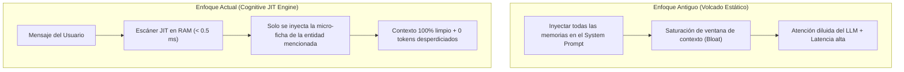
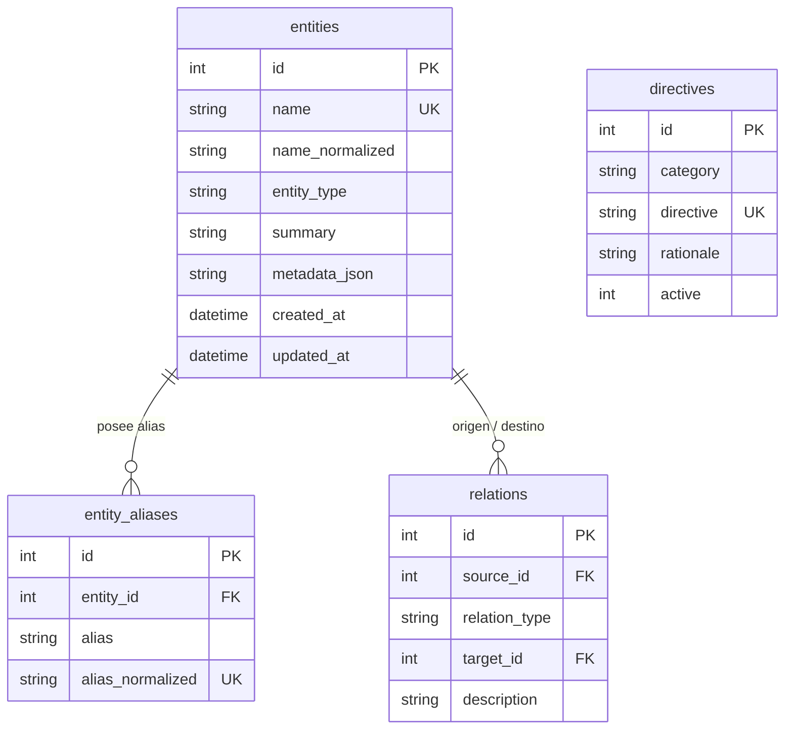
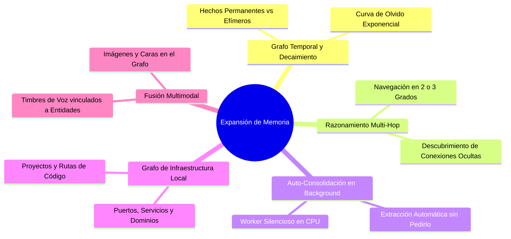

# AI Lab — Cognitive Memory Engine 2.0: Manual Arquitectónico y Guía de Expansión

**Autor:** AI Lab Engine Team  
**Fecha:** 31 de Agosto de 2026  
**Componente:** [`scripts/tools/knowledge_graph.py`](file:///home/darkseid/ai-lab/scripts/tools/knowledge_graph.py)  
**Estado:** Activo en Producción / Bucle de Voz & Agente ReAct.

---

## 1. Filosofía Arquitectónica: Memoria JIT vs. Volcado Estático



> [!IMPORTANT]
> **Principio de Eficiencia Cognitiva:**  
> Las directivas operativas (cómo procesar la información) son globales y ligeras (~15 tokens). Los datos factuales y relaciones (personas, apodos, equipos) viven indexados en el disco/RAM y **solo se inyectan de forma Just-In-Time si se detecta su mención en la consulta**.

---

## 2. Los 3 Niveles de la Pirámide de Memoria

```
+---------------------------------------------------------------------------------------+
| NIVEL 1: DIRECTIVAS Y METODOLOGÍAS APRENDIDAS (Memoria Procedimental)                 |
| • Reglas permanentes que dictan el comportamiento y estructura del modelo.           |
| • Ej: "Fragmentación Atómica: Descomponer hechos en entidades independientes".        |
+---------------------------------------------------------------------------------------+
| NIVEL 2: GRAFO DE CONOCIMIENTO Y ALIAS JIT (Memoria Semántico-Relacional)             |
| • Entidades atómicas, alias normalizados y tripletas Sujeto-Predicado-Objeto.         |
| • [José Miguel Martínez] --CAPITAN_DE--> [Real Recursantes]                           |
| • [José Miguel Martínez] --ALIAS--> ["el Capi", "Pirinola", "Miguelito"]             |
+---------------------------------------------------------------------------------------+
| NIVEL 3: RAG VECTORIAL EPISÓDICO (Memoria de Contenido Denso)                         |
| • Indexación de código, documentos Markdown y conversaciones históricas completas.   |
+---------------------------------------------------------------------------------------+
```

---

## 3. Esquema de Base de Datos (`knowledge_graph.db`)

Ubicación física: `~/.local/share/ai-lab/memory/knowledge_graph.db`



---

## 4. Manual de Comandos de Inspección y Diagnóstico

### 4.1. Dashboard Visual en Terminal
Muestra en tiempo real todas las directivas, entidades, apodos y relaciones activas:
```bash
python3 ~/ai-lab/scripts/tools/knowledge_graph.py
```

### 4.2. Simulación JIT (Prueba de Detección sin LLM)
Verifica exactamente qué información inyectará el escáner JIT ante un mensaje:
```bash
# Ejemplo con alias múltiple:
python3 ~/ai-lab/scripts/tools/knowledge_graph.py -q "Dile a la Pirinola que nos vemos en la cancha"

# Ejemplo con tema no relacionado (comprueba cero contaminación de contexto):
python3 ~/ai-lab/scripts/tools/knowledge_graph.py -q "¿Cómo calculo una integral triple?"
```

### 4.3. Exportación en JSON (Para APIs y Automatización)
```bash
python3 ~/ai-lab/scripts/tools/knowledge_graph.py --json
```

---

## 5. Roadmap de Expansión y Nuevos Usos Propuestos

Para llevar la memoria de AI Lab al siguiente nivel de sofisticación:



### 1. Grafo Temporal con Decaimiento Cognitivo (Memoria a Corto vs Largo Plazo)
* **Problema:** No todos los hechos duran para siempre. *"Estoy en la biblioteca estudiando"* es relevante hoy, pero irrelevante el próximo mes.
* **Propuesta:** Añadir campos `ttl` (Time to Live) y pesos de recencia con decaimiento exponencial:
  $$S(t) = S_0 \cdot e^{-\lambda t}$$
  Los hechos fundamentales (familia, apodos, amigos) tienen $\lambda = 0$ (permanentes), mientras que estados temporales expiran automáticamente.

### 2. Razonamiento Multi-Hop (Grafos de Conexiones Complejas)
* **Capacidad:** Responder preguntas que requieren saltar por múltiples nodos interconectados.
* **Ejemplo:**
  * Usuario: *"¿Quién juega en el mismo equipo que la Pirinola?"*
  * Salto 1: `la Pirinola` $\rightarrow$ `José Miguel`.
  * Salto 2: `José Miguel` $\rightarrow$ `Real Recursantes`.
  * Salto 3: `Real Recursantes` $\rightarrow$ Lista de integrantes.

### 3. Worker de Auto-Consolidación Silenciosa (Zero-Effort Memory)
* Un micro-proceso que, al finalizar un diálogo (o al cerrar la WebUI), analiza el texto en CPU con expresiones de extracción o un modelo ligero (E4B / regex estructurado).
* Extrae automáticamente nuevas personas, equipos, compromisos o directivas y las guarda en el grafo sin que tengas que decir "aprende esto".

### 4. Grafo de Infraestructura y Proyectos Técnicos (Developer Mind-Map)
* Extender el grafo para almacenar tu mapa de sistemas:
  * Entidad: `ai.castelancarpinteyro.com` $\rightarrow$ `APUNTA_A` $\rightarrow$ `VPS Plesk (74.208.62.188:9095)`.
  * Entidad: `gemma4-server` $\rightarrow$ `CORRE_EN` $\rightarrow$ `RTX 5060 (:9090, 64k Contexto)`.
* Esto le permite al LLM recordar instantáneamente toda la topología de tus servidores sin tener que investigarla desde cero.

### 5. Reconocimiento de Voz Multi-Usuario vinculado a Entidades
* Vincular las huellas acústicas o identificadores de voz capturados por el motor de audio a las entidades del grafo.
* Cuando otra persona hable al micrófono, el asistente podrá identificar si es Grecia, Karol o José Miguel y adaptar su tono y memoria automáticamente.
